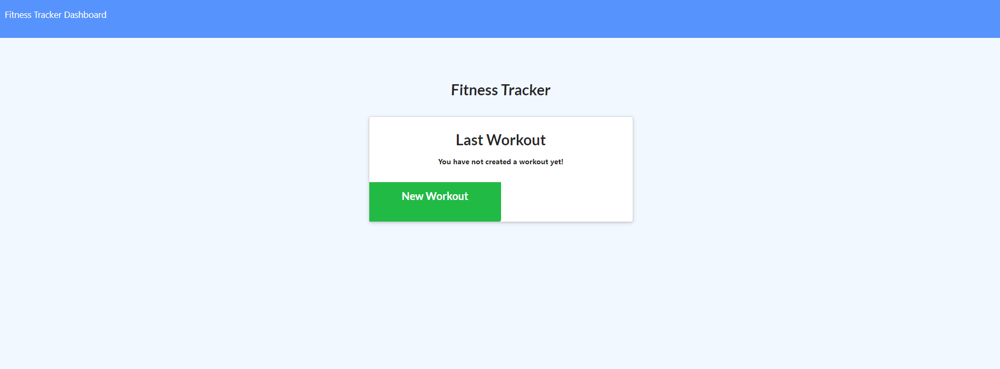

# Workout-tracker

Description
------------

Tracker will track current workout being performed. Exercises can be added throughout the workout. Plus there is a stats page giving an infographic of the exercises that have been performed. The frontend files were given by Trilogy. 

 Table of contents
---------------
[Tools used](#Tools-used) 
[Deployed here](#Deployed-here) 
[Features](#Features) 
[Lessons learned](#Lessons-learned) 
[Credits](#Credits) 
[License](#License)

Tools used
-------------------
* Bulma - CSS framework to help style the code efficiently.
* Express - Link front end and back end together via routes.
* GitBash - Assist with version control via commits, push, and pull to and from GitHub.
* GitHub - Site where the repository lies for deployment and edits.
* Handlebars - Gives template used to help bring code from the backend to frontend for HTML design.
* MySQL - Database to store data for application use.
* Node.js - Build the template and all functions in application. 
* VS Code - Application used to write and edit code for the application.

Deployed here
-------------

Below is the link to the deployed site.  
[Link to deployed site](https://personal-workout-tracking.herokuapp.com/)

Features
------------------

The user has the capablity to add burgers to either list of not eaten or devoured burgers. Once added, the burgers may be eaten or ordered again by clicking on their respective buttons. This will move the burger to the opposite list to demonstrate whether the burger has or has not been eaten.

Credits
---------------
LinkedIn: [https://www.linkedin.com/in/vincent-nguyen-74226a107/](https://www.linkedin.com/in/vincent-nguyen-74226a107/)  
GitHub: [https://github.com/vincent-nguyen8931](https://github.com/vincent-nguyen8931)  
Portfolio: [https://vincent-nguyen8931.github.io/Vincent-nguyen8931-portfolio/](https://vincent-nguyen8931.github.io/Vincent-nguyen8931-portfolio/)

License
----------
MIT License

Copyright (c) [2021] [Vincent Nguyen]

Permission is hereby granted, free of charge, to any person obtaining a copy
of this software and associated documentation files (the "Software"), to deal
in the Software without restriction, including without limitation the rights
to use, copy, modify, merge, publish, distribute, sublicense, and/or sell
copies of the Software, and to permit persons to whom the Software is
furnished to do so, subject to the following conditions:

The above copyright notice and this permission notice shall be included in all
copies or substantial portions of the Software.

THE SOFTWARE IS PROVIDED "AS IS", WITHOUT WARRANTY OF ANY KIND, EXPRESS OR
IMPLIED, INCLUDING BUT NOT LIMITED TO THE WARRANTIES OF MERCHANTABILITY,
FITNESS FOR A PARTICULAR PURPOSE AND NONINFRINGEMENT. IN NO EVENT SHALL THE
AUTHORS OR COPYRIGHT HOLDERS BE LIABLE FOR ANY CLAIM, DAMAGES OR OTHER
LIABILITY, WHETHER IN AN ACTION OF CONTRACT, TORT OR OTHERWISE, ARISING FROM,
OUT OF OR IN CONNECTION WITH THE SOFTWARE OR THE USE OR OTHER DEALINGS IN THE
SOFTWARE.